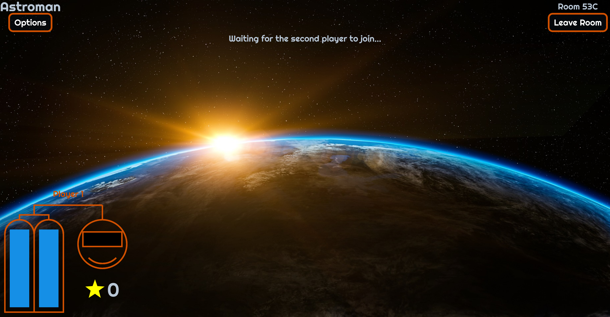
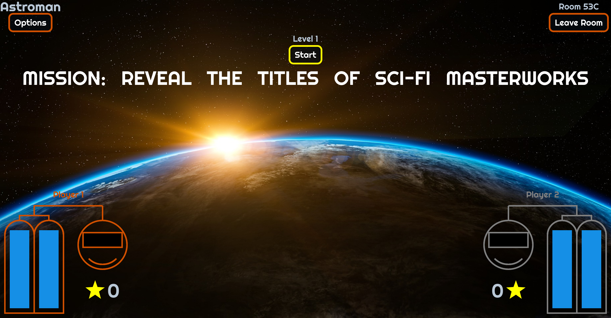
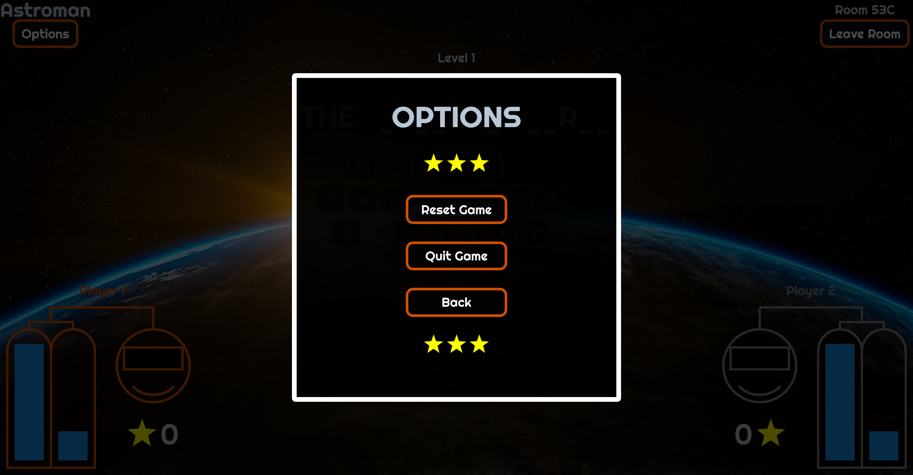

# Astroman

Real-time multiplayer.

## Screenshots

## Game Mechanics

In this hangman-inspired game, set in space, two players compete to uncover the concealed title of a randomly selected science-fiction book. The players take turns to guess letters: if the book title contains the letter, the player can go again. If the guess is incorrect, the player loses one of their 8 lives (oxygen) and their turn. The player that uncovered the last letter in the book title gains one point.
The game consists of unlimited number of rounds and ends when one of the players runs out of oxygen. Player with higher score wins. If it's a tie, the player with lives/ oxygen left wins.
Players can restart, go back to or quit the game from the Options modal.

## Tech Stack

- [Node.js](https://nodejs.org/en/docs/) - an open-source JavaScript runtime environment for building server-side applications
- [Express](https://expressjs.com/) - a web application framework for Node.js that makes it easier to build and manage APIs
- [Socket.IO](https://socket.io/) - a JavaScript library for real-time, bidirectional communication between web clients and servers
- [Typescript](https://www.npmjs.com/package/typescript) - a typed version of JavaScript that improves code quality and maintenance
- [React](https://reactjs.org/) - a JavaScript library for building user interfaces.
- [Redux](https://redux.js.org/) - a state management library for JavaScript applications
- [Redux Toolkit](https://redux-toolkit.js.org/) - an official opinionated package that simplifies the use of Redux
